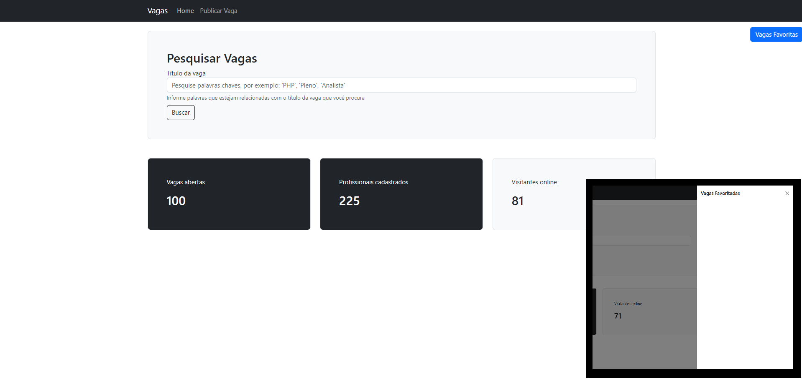
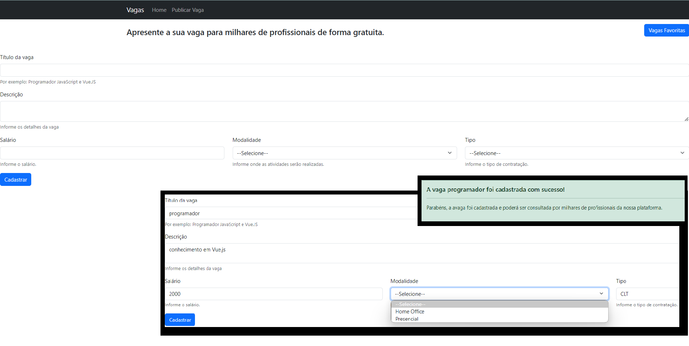
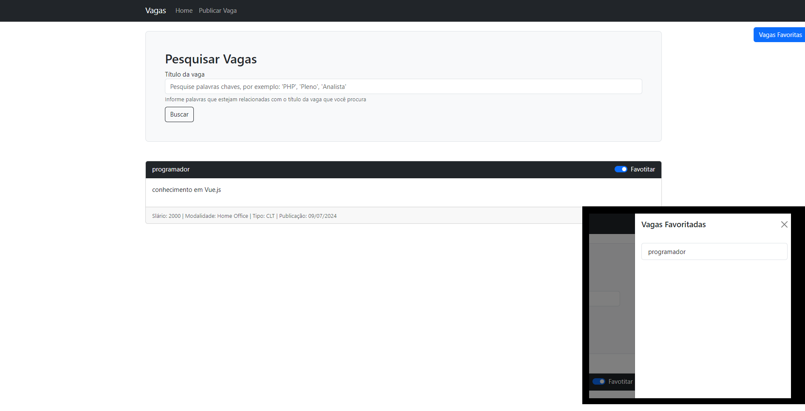

<h1 align="center"> Vagas Front </h1>

<p align="center">
  <a href="#-tecnologias">Tecnologias</a>&nbsp;&nbsp;&nbsp;|&nbsp;&nbsp;&nbsp;
  <a href="#-projeto">Projeto</a>
</p>

<br>

<p align="center">
  
</p>
<p align="center">
  
</p>
<p align="center">
  
</p>

## 🚀 Tecnologias

Esse projeto foi desenvolvido com as seguintes tecnologias:

- Vue.js
- TypeScript
- Git e Github

## 💻 Projeto

O Vagas Front é um aplicativo gerenciador de vagas de emprego, em que o suário pode criar novas vagas através do preenchimento de um formulário, pode pesquisar por vagas cadastradas e favoritá-las. As vagas ficam organizadas por título, descrição, salário, modalidade, tipo e data de publicação.

---

## Project setup
```
npm install
```

### Compiles and hot-reloads for development
```
npm run serve
```

### Compiles and minifies for production
```
npm run build
```

### Lints and fixes files
```
npm run lint
```

### Customize configuration
See [Configuration Reference](https://cli.vuejs.org/config/).
